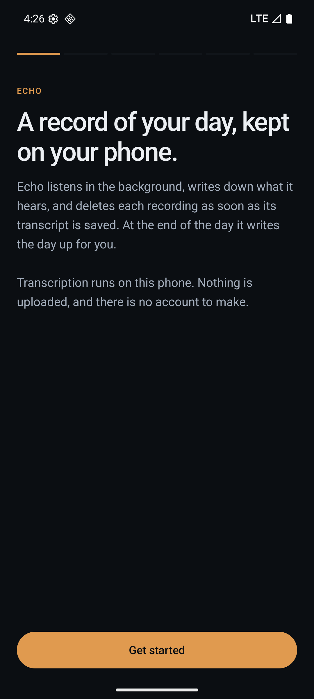
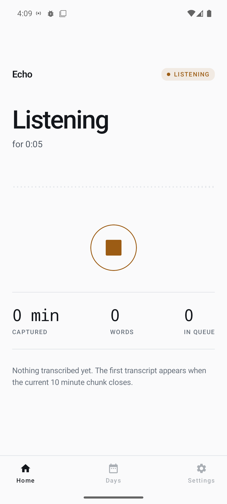
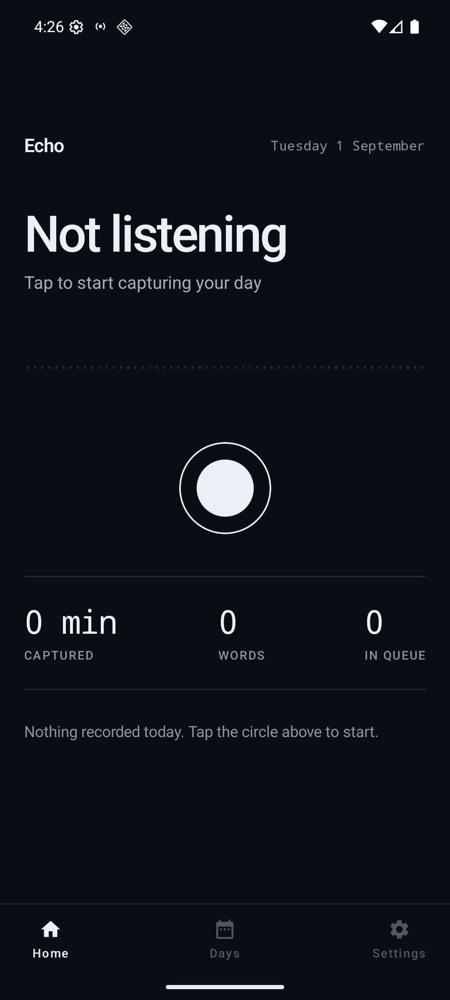

<h1 align="center">Echo</h1>

<p align="center"><b>Your spoken life, written down. On your phone, and nowhere else.</b></p>

<p align="center">
  
  
  
</p>

Echo listens all day, transcribes what it hears **on the device**, deletes each recording the
moment its transcript is saved, and writes your day up at 11 PM.

No account. No upload. No subscription. No extra hardware, because you already carry a
microphone all day.

**[Download the APK](https://github.com/mandarwagh9/echo/releases)** · Android 10+, arm64 ·
25 MB · public beta 0.9.0

---

## The problem

Everyone who tried to build an ambient recorder built the same thing: a $200 pendant, a
subscription, and a pipe to somebody else's server. Then the category consolidated into big
tech. Limitless was [acquired by Meta](https://www.cnbc.com/2025/12/05/meta-limitless-ai-wearable.html)
in December 2025 and its Pendant is no longer sold to new customers. Bee was
[acquired by Amazon](https://techcrunch.com/2025/07/22/amazon-acquires-bee-the-ai-wearable-that-records-everything-you-say/)
in July 2025. What is still on sale, like [Plaud's](https://www.plaud.ai) NotePin S, is
hardware you buy once plus a plan you pay for monthly.

So the honest state of the art for "remember my life" is: buy a second device, pay monthly, and
send every conversation you have, plus every conversation of everyone standing near you, to a
company that was just bought by a larger one.

Echo is the version that runs on the phone already in your pocket and keeps the audio there.

## The thing nobody says out loud

Ambient AI is sold as a solved problem. It is solved in English.

Measured against known references, on-device Whisper Base recovers **0.23 of Hindi words and
0.00 of Marathi**. Not "worse". Zero. A day of Marathi through Base produces a transcript that
is not a transcript.

That measurement is why this codebase is shaped the way it is. Transcription is a swappable
backend rather than a hardcoded call, because the honest answer for Devanagari today is a model
bigger than a phone can hold, and pretending otherwise ships a product that quietly fails for
the languages a billion people actually speak.

| Backend | Where it runs | Hindi / Marathi | The trade |
|---|---|---|---|
| **On device** (default) | whisper.cpp, your phone | 0.23 / 0.00 | Nothing leaves. Cannot do Devanagari. |
| **Your server** | self-hosted IndicConformer-600M | 1.00 / 1.00 | Audio goes to a server you run. |
| **Batch** | Google Cloud, `gcp/` | 1.00 / 1.00 | Audio uploaded, transcribed later, cheapest. |

Word recall against known references. Every figure comes from text-to-speech clips rather than
far-field room audio, so read them as a floor on how bad a model is, not a promise of how good.
The public build ships with **no server of its own**: rows two and three do nothing until you
point them at something you run. Numbers in [docs/VERIFICATION.md](docs/VERIFICATION.md).

## Why this is possible now

On-device speech got fast enough to keep up with a life, on hardware people already own.

Measured on a Pixel 9: **5.3x realtime** with the shipping Base model on 4 threads. 66 seconds
of audio transcribed in 12.5 seconds, which puts a full 10-minute chunk at about 113 seconds.
That number is the whole product. A 24/7 recorder that transcribes slower than it records has a
queue that never drains and eventually eats the disk. 5.3x has margin. 0.9x would be a demo.

## How it works

```
mic ──► 10-min WAV chunks ──► voice-activity gate ──► whisper.cpp ──► transcript in SQLite
                                                                            │
                                                                     audio deleted
                                                                            │
                                                                    11 PM   ▼
                                                                     your day, written up
```

- **Recording outranks everything.** A dedicated reader thread does nothing but drain
  `AudioRecord`. No file I/O, no database, no allocation. If the writer stalls the queue grows,
  and the microphone is never blocked.
- **Chunk rotation is sample-exact.** Rotation happens at exactly 9,600,000 samples without ever
  stopping the recorder, so chunk *N+1* begins on the sample after chunk *N*. No gaps, by
  construction.
- **Audio is deleted only once its transcript is proven safe.** Never before, and never merely
  because a copy reached a bucket somewhere.
- **Silence is skipped.** Most of a day is room tone, and Whisper on near-silence reliably
  invents sentences. The gate removes a whole class of garbage, and a lot of battery.

## Status

**Public beta, 0.9.0.** Honestly: you would be early.

Echo has run on the author's own phone since 5 August 2026. One day of that record holds
**13,887 transcribed words across 10 h 25 min of speech**, from 1,380 chunks, 512 of which were
skipped as silence. That is the traction: one person, one phone, a real archive. There are no
other users yet.

The interface was rebuilt for people who did not write it, and first run was walked end to end
on a clean device: consent, permissions, the battery exemption, model download, recording.
Battery behaviour was reworked at the same time, and **those changes are reasoned rather than
measured**. There is no `batterystats` baseline yet.

**It cannot ship on Google Play.** A 24/7 recorder needs the Doze exemption, and requesting it
directly violates Play's content policy, which allows it only for app types a personal journal
is not on. That is a deliberate trade rather than an oversight: without the exemption recording
stops overnight, which is not a degraded product but the absence of one. So Echo is distributed
as a signed APK.

## Install

Download the APK from [Releases](https://github.com/mandarwagh9/echo/releases), allow your
browser to install unknown apps when Android asks, and open it. Setup handles the rest.

Echo asks for three things, and all three are load-bearing:

| | Why |
|---|---|
| Microphone | The whole app. |
| Notifications | The ongoing notification is the only always-visible sign a recorder is running, and the alert channel is how Echo tells you capture stopped. |
| Background running | Android suspends apps once the screen has been off a while. **This is the step people skip and then report as a bug.** |

Then it downloads a speech model once, and works offline afterwards.

## Privacy, and the law

On the default backend, audio and transcripts never leave the device. Storage is app-private,
cloud backup is disabled, and "Delete everything" really does wipe the database and the files.

That does not make Echo safe to use casually. **It records people who have not consented.**
India's DPDP Act governs processing other people's personal data; using this in a
two-party-consent jurisdiction, or anywhere under GDPR, is a live legal problem. The persistent
notification and the always-visible recording state are deliberate. They are the only honest
signal the people around you get.

Echo says this on the second screen of setup, before it ever opens the microphone, and makes
you acknowledge it. That is on purpose.

## Build it yourself

```bash
git clone --recurse-submodules https://github.com/mandarwagh9/echo.git
cd echo
./gradlew :app:assembleRelease -PechoAbi=arm64-v8a
adb install -r app/build/outputs/apk/release/app-release.apk
```

That is a **personal** build: it reads the endpoints in `local.properties` and is signed with
the Android debug key. A build meant for anyone else is

```bash
./gradlew :app:assembleRelease -PechoDistribution=public -PechoAbi=arm64-v8a
```

which compiles those endpoints out entirely and signs with the upload key from
`keystore.properties` (`scripts/make-release-key.ps1` creates it, once). The build refuses to
produce a public APK without that keystore, so the secret-free artifact and the debug-signed one
cannot be the same file.

Toolchain: JDK 17, Android SDK 36, NDK 27.1, CMake 3.22. whisper.cpp is a submodule pinned to
v1.9.2; run `git submodule update --init` if you cloned flat.

## Known limitations

- **Reboot does not auto-resume.** Android excludes microphone foreground services from
  background-start exemptions, so Echo posts a "tap to resume" notification instead. An OS
  constraint, not an oversight.
- **The mic is exclusive.** A call, the assistant, or another recorder takes it away. Echo
  retries with backoff, but audio in that window is genuinely lost.
- **Base is weak on Devanagari.** The honest headline limitation, quantified above.
- **Name detection keys off capitalisation**, so it works in English and misses Hindi and
  Marathi names entirely. The UI labels it approximate rather than pretending.
- **OEM battery managers** (Xiaomi, Samsung, OnePlus) may kill long-running services anyway.
- **Throughput, not accuracy, is the binding constraint.** The temperature-fallback ladder is
  deliberately capped for exactly this reason.

## Layout

```
app/src/main/
  cpp/                 JNI bridge + CMake for whisper.cpp
  java/com/mandar/echo/
    audio/             capture, chunking, WAV, VAD, foreground service
    stt/               whisper engine, model download, transcription pipeline
    data/              Room entities, DAOs, settings
    summary/           summariser, TextRank, scheduling
    ui/                Compose screens, onboarding, design system
app/src/test/          JVM unit tests
app/schemas/           exported Room schemas, committed
gcp/                   the batch tier: upload service and reaper job
eval/                  chirp3_eval.py, scores a backend on the shared fixtures
third_party/whisper.cpp
```

Deeper reading: [SYSTEM_DESIGN.md](docs/SYSTEM_DESIGN.md) for the queue's invariants,
[VERIFICATION.md](docs/VERIFICATION.md) for what was measured on hardware,
[ARCH-2026-08-10-batch-first.md](docs/ARCH-2026-08-10-batch-first.md) for the batch pipeline.

## Licence

No licence has been granted yet, which by default means all rights reserved: read the source,
build it for yourself, but there is no permission here to redistribute or build on it. If you
want to, open an issue and ask.

whisper.cpp is vendored as a submodule and is MIT, (c) Georgi Gerganov.
